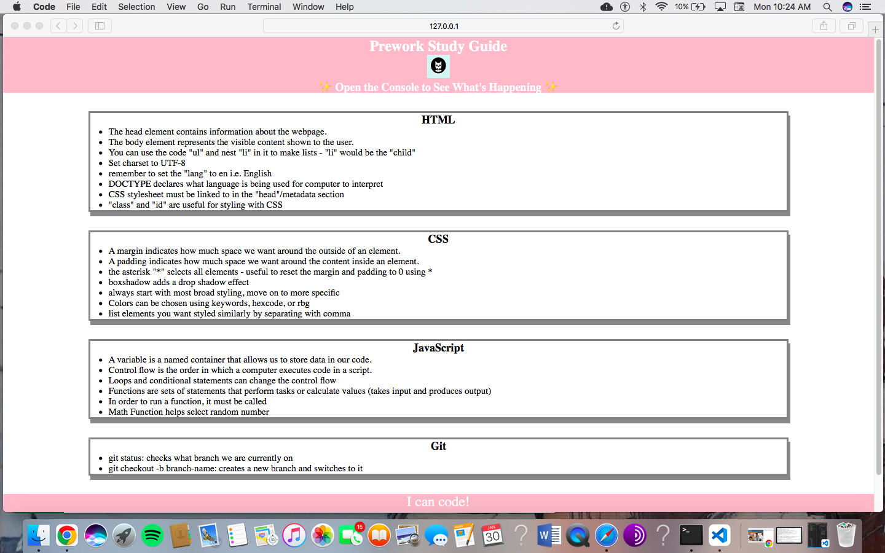

# <Prework-Study-Guide>

## Description

This study guide was created for bootcamp students who were working through the Prework. It contains HTML, CSS, git, and JavaScript. It consolidates and organizes these notes by topic.

## Table of Contents (Optional)

If your README is long, add a table of contents to make it easy for users to find what they need.

- [Usage](#usage)
- [Credits](#credits)
- [License](#license)

## Usage

To use this study guide, you can navigate to each section/topic and review the notes. 

For suggestions on what to study first, open the Chrome DevTools by right-clicking and choosing 'Inspect.' A console panel should open either below or to the side of the webpage. There, you will see a list of topics along with a random suggestion on which topic to study first. 

## Credits

[Instructions:](https://courses.bootcampspot.com/courses/3206/pages/3-dot-5-3-create-a-professional-project-readme?module_item_id=823896)